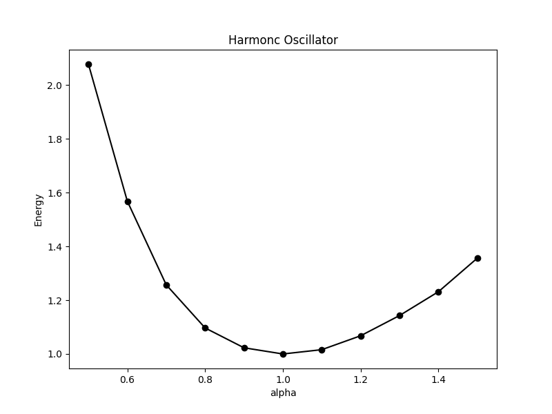

# Ground State Energy Estimation using Variational Monte Carlo  

This project uses **Variational Monte Carlo (VMC)** with the **Metropolis algorithm** to estimate the ground-state energy of:  

- **Quantum Harmonic Oscillator**  
- **Hydrogen Atom**  

The variational parameter **α** is optimized to minimize the expectation value of the Hamiltonian, providing an approximation of the ground-state energy.
## Features  
- Uses **Metropolis algorithm** for Monte Carlo sampling  
- Computes **ground-state energy** for both systems  
- Optimizes **variational parameter α**  
- **Plots**:  
  - Energy vs. α  
  - Histogram of sampled positions  
- Outputs **table of α, energy, and variance**  
## How to Run  

### **Option 1: Jupyter Notebook**  
1. Download the `.ipynb` file.  
2. Open Jupyter Notebook.  
3. Run the cells in order.  

### **Option 2: Google Colab**  
1. Open [Google Colab](https://colab.research.google.com/).  
2. Click **"File" → "Upload Notebook"**.  
3. Select the `.ipynb` file.  
4. Run the cells.  
## Dependencies  
Ensure you have the following Python libraries installed:  
- NumPy  
- Matplotlib  

To install missing libraries, run:  
```bash
pip install numpy matplotlib

---

#### **5. Methodology**  
```markdown
## Methodology  

### **1. Harmonic Oscillator**  
- **Trial Wavefunction:**  
  - `ψ(x) ∝ exp(-α² x² / 2)`  

- **Energy Estimation:**  
  - `E(α) = α² + x² (1 - α⁴)`  

- **Metropolis Algorithm:**  
  - Samples position space using **ψ(x)²**  
  - Uses **random walk** with step size  

- **Variational Monte Carlo (VMC):**  
  - Runs Monte Carlo sampling  
  - Computes **mean energy** & **variance**  

---

### **2. Hydrogen Atom**  
- **Trial Wavefunction:**  
  - `ψ(r) ∝ α r exp(-α r)`  

- **Energy Estimation:**  
  - `E(α) = E(α) = (-α / 2) * (α - 2 / r) - 1 / r^1.1  

- **Metropolis Algorithm:**  
  - Samples **radial position space** using **ψ(r)²**  
  - Uses **random walk in 3D space**  

- **Variational Monte Carlo (VMC):**  
  - Computes **mean energy** & **variance**  
## Example Output  
### **Plot of Variational Parameter vs. Energy**  
#### *Harmonic Oscillator:*



#### *Hydrogen Atom:*  
### **Table of Variational Parameter, Energy, and Variance**  
#### *Harmonic Oscillator:*  


#### *Hydrogen Atom:*  


## Notes  
- Results depend on **step size** and **sampling iterations**.  
- The optimal α is found by minimizing the energy**.  
- Hydrogen simulation runs in **3D**, while Harmonic Oscillator is **1D**.  


 

